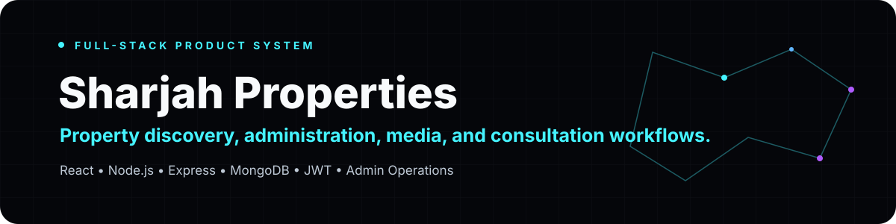
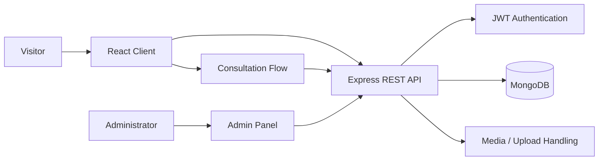

<div align="center">



<br/>

[](#technology-stack)
[](#technology-stack)
[](#technology-stack)
[](#technology-stack)
[](#technology-stack)

**A full-stack real-estate platform combining property discovery, consultation flows, media handling, authentication, and an operational admin surface.**

[Live application](https://sharjah-properties.vercel.app)

</div>

---

## Product idea

Sharjah Properties was built as more than a static listings website. The system separates the public property-discovery experience from the operational work required to manage listings, inquiries, media, and authenticated administration.

The project demonstrates how a user-facing React application, a REST API, persistent storage, authentication, and an admin console fit together as one product.

---

## System surface



---

## Core capabilities

| Area | Capabilities |
|---|---|
| **Property discovery** | Listing pages, property detail views, responsive browsing, structured property information |
| **Consultations** | Inquiry and viewing-request flows persisted through the backend |
| **Administration** | Dashboard, property CRUD, consultation management, protected admin routes |
| **Authentication** | JWT-based admin authentication and protected operations |
| **Media** | Property image upload and management through backend middleware |
| **API** | REST endpoints for properties, consultations, and authenticated admin operations |
| **UX** | Responsive interface, toast feedback, navigation, contact flows, WhatsApp integration |

---

## Technology stack

### Frontend

- React 18
- Vite
- Tailwind CSS
- React Router
- Axios
- Framer Motion
- Lucide React

### Backend

- Node.js
- Express
- MongoDB
- Mongoose
- JWT authentication
- bcrypt
- Multer
- CORS

### Admin surface

- React
- Tailwind CSS
- Protected routing
- API-backed property and consultation management

---

## Representative API surface

```text
POST   /api/admin/login
GET    /api/admin/verify

GET    /api/properties
GET    /api/properties/:id
POST   /api/properties
PUT    /api/properties/:id
DELETE /api/properties/:id

GET    /api/consultations
POST   /api/consultations
PUT    /api/consultations/:id
DELETE /api/consultations/:id
```

Administrative mutations are intended to be protected by authentication rather than relying on client-side route visibility.

---

## Project structure

```text
sharjah-properties/
├── src/                  # Public React application
│   ├── components/
│   ├── pages/
│   ├── services/
│   └── context/
├── admin-panel/          # Authenticated operations UI
│   └── src/
├── backend/              # Express API + MongoDB models
│   ├── controllers/
│   ├── middleware/
│   ├── models/
│   ├── routes/
│   └── server.js
├── docs/
└── README.md
```

---

## Local development

### Prerequisites

- Node.js
- npm
- MongoDB (local or hosted)

### Install

```bash
git clone https://github.com/usman611b/sharjah-properties.git
cd sharjah-properties
npm install

cd backend
npm install

cd ../admin-panel
npm install
```

Create the backend environment configuration with your own database connection and secrets.

Example shape:

```env
MONGO_URI=<your-mongodb-uri>
JWT_SECRET=<strong-random-secret>
PORT=5000
```

Do not commit production credentials or default administrator passwords to the repository.

---

## What this project demonstrates

This repository is evidence of working across a complete application boundary:

**interface → routing → API integration → authentication → persistent data → administration → deployment**

The project is useful on the profile because it shows software engineering breadth beyond model- or notebook-only work.

---

<div align="center">

### Product engineering, end to end.

**Usman Ali** · [GitHub](https://github.com/usman611b) · [Portfolio](https://www.usmanalii.com/)

</div>
